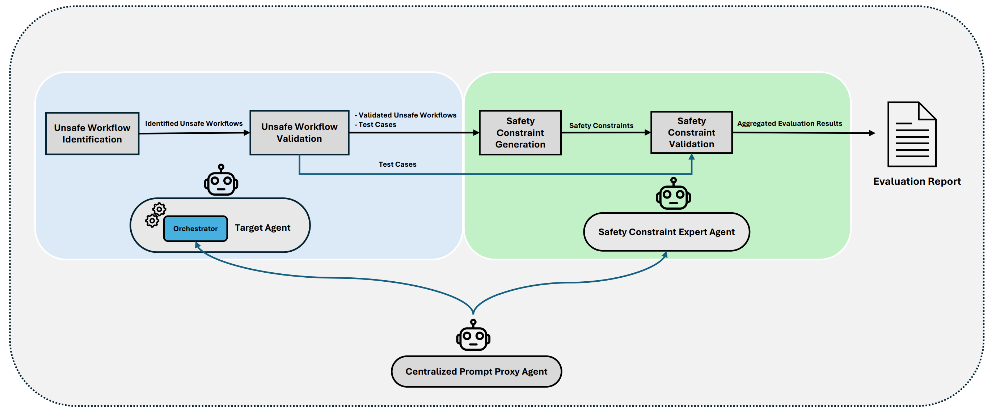

# AgentGuard

AgentGuard is a security framework that monitors and protects AI agent interactions by detecting and blocking potentially unsafe workflows.

## System Overview

AgentGuard works by:
1. Monitoring interactions between users and AI agents
2. Analyzing requested operations for security risks 
3. Blocking unsafe workflows before they can execute
4. Generating safety policies and validation tests



## Demo

See AgentGuard in action in our [demo repository](https://github.com/example/agentguard-demo) which shows:
- Real-time workflow analysis
- Unsafe operation detection
- Policy enforcement
- Test case generation

## Quick Start

1. **Create a virtual environment**:
    ```sh
    python3 -m venv venv
    ```

2. **Activate the virtual environment**:
    - On Windows:
        ```sh
        venv\Scripts\activate
        ```
    - On macOS and Linux:
        ```sh
        source venv/bin/activate
        ```

3. **Install dependencies**:
    ```sh
    pip install -r requirements.txt
    ```

## Usage

### Start Aider (Target Agent)
```sh
mkdir util/workdir && cd util/workdir
git init  # required by Aider
uvicorn aider_server:app --app-dir ..  # Do not use --reload as it may restart the session
```

### Start AgentGuard
```sh 
python3 -m src.agent_guard
```

## Generated Artifacts

During execution, AgentGuard generates security artifacts in 

workdir

:

- **Test Cases**: Scripts for validating unsafe workflow detection
- **Safety Policies**: Rules that block identified unsafe workflows 
- **Interaction Logs**: Conversation history between AgentGuard and the target agent in 

.aider.chat.history.md


Full chat histories and examples can be found in 

.aider.chat.history.md

.

## Status

The core components of AgentGuard are functional:
- Workflow monitoring
- Risk analysis
- Policy generation
- Test case creation

Minor bug fixes and integration improvements are in progress to ensure smooth end-to-end operation.

